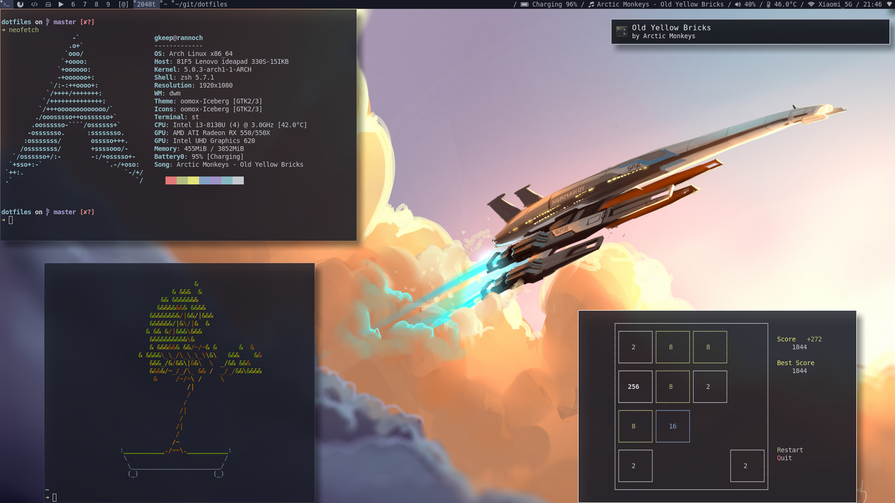
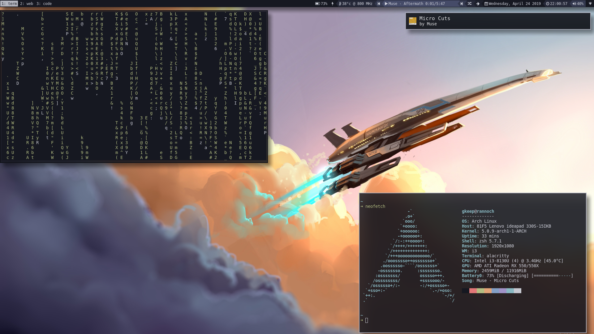
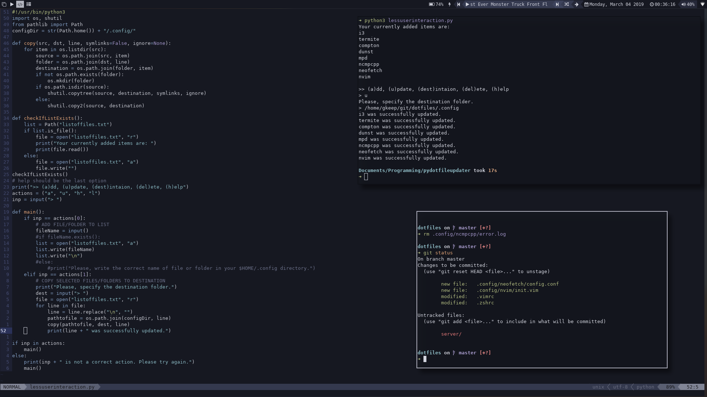
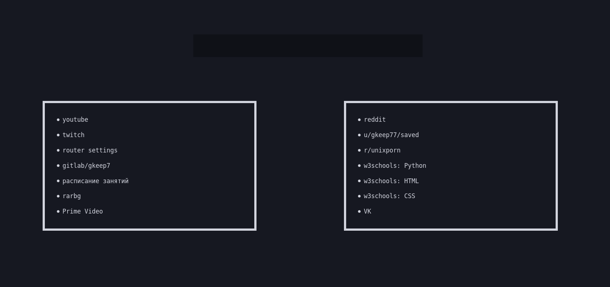

# dotfiles

## dwm (my final dwm setup, which I used for 3 weeks)
Applied patches:

1. 
2. 
3. 
4. 
5. 
6. 
7. 
8. 
9. 

**Scripts** (startup, bar, etc) are at **.dwm** folder. My suckless **configs** (dwm, st, dmenu) are located at **suckless** folder.

## i3wm

## neovim

Installed plugins and active theme:

1. [emmet-vim](https://github.com/mattn/emmet-vim)
2. [lightline](https://github.com/itchyny/lightline.vim)
3. Theme for vim/neovim and lightline: [iceberg.vim](https://github.com/cocopon/iceberg.vim)
4. [vim-polyglot](https://github.com/sheerun/vim-polyglot)
5. [auto-pairs](https://github.com/jiangmiao/auto-pairs)
6. [vim-gitgutter](https://github.com/airblade/vim-gitgutter)
7. [nerdtree](https://github.com/scrooloose/nerdtree)

## startpage

A simple startpage with frequently visited websites and duckduckgo search bar.

## bumblebee-status

iceberg-dark-powerline.json is custom bumblebee-status colour scheme inspired by iceberg colour scheme for termite, vim and vscode

### installation

Put iceberg-dark-powerline.json in your **bumblebee-status/themes/** folder (e.g. /home/*username*/bumblebee-status/themes/iceberg-dark-powerline.json)

If you installed bumblebee-status via AUR put the .json file in **/usr/share/bumblebee-status/themes/** so path to the file is */usr/share/bumblebee-status/themes/iceberg-dark-powerline.json*.

