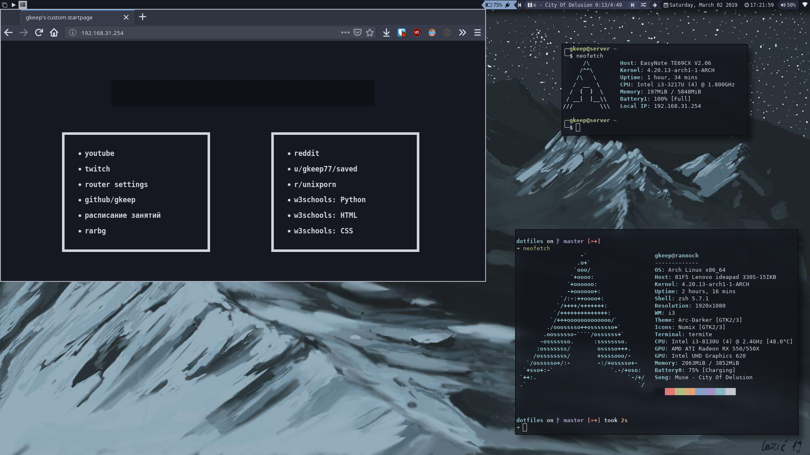

# MOVED TO [GITLAB](https://gitlab.com/gkeep7/dotfiles)
# dotfiles

## neovim

Installed plugins and active theme:

1. [emmet-vim](https://github.com/mattn/emmet-vim)
2. [lightline](https://github.com/itchyny/lightline.vim)
3. Theme for vim/neovim and lightline: ~~[onedark.vim](https://github.com/joshdick/onedark.vim)~~ [iceberg.vim](https://github.com/cocopon/iceberg.vim)
4. [vim-polyglot](https://github.com/sheerun/vim-polyglot)
5. [auto-pairs](https://github.com/jiangmiao/auto-pairs)
6. [vim-gitgutter](https://github.com/airblade/vim-gitgutter)
7. [nerdtree](https://github.com/scrooloose/nerdtree)

## startpage

A simple startpage with frequently visited websites and duckduckgo search bar.

## bumblebee-status

iceberg-dark-powerline.json is custom bumblebee-status colour scheme inspired by iceberg colour scheme for termite, vim and vscode

### installation

Put iceberg-dark-powerline.json in your **bumblebee-status/themes/** folder (e.g. /home/*username*/bumblebee-status/themes/iceberg-dark-powerline.json)

If you installed bumblebee-status via AUR put the .json file in **/usr/share/bumblebee-status/themes/** so path to the file is */usr/share/bumblebee-status/themes/iceberg-dark-powerline.json*.

