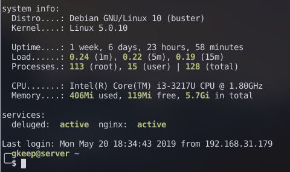

### MOTD and system info:

* Debian 10 (buster) as OS
* 120 GB SSD for OS
* 500 GB HDD for everything else

Repurposed my old laptop for seeding torrents and running my startpage on the local network.

**30-updates** is my MOTD module which shows available updates each time you lag in via ssh.
For it's proper work you need to add last two lines from `crontab` file in this directory to your crontab.
